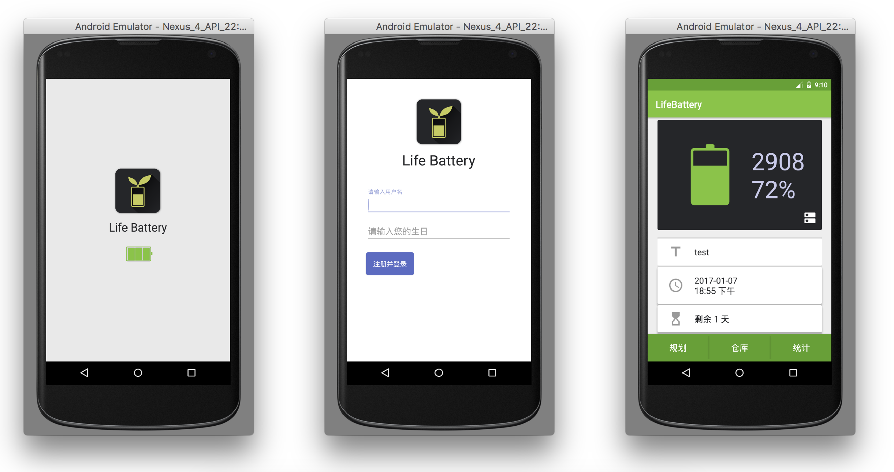
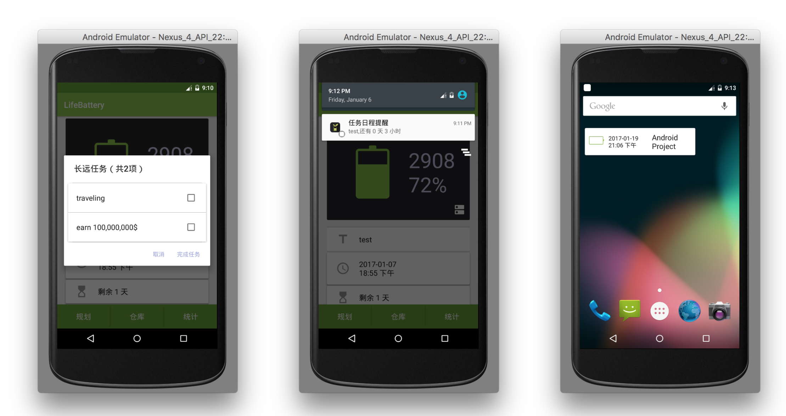
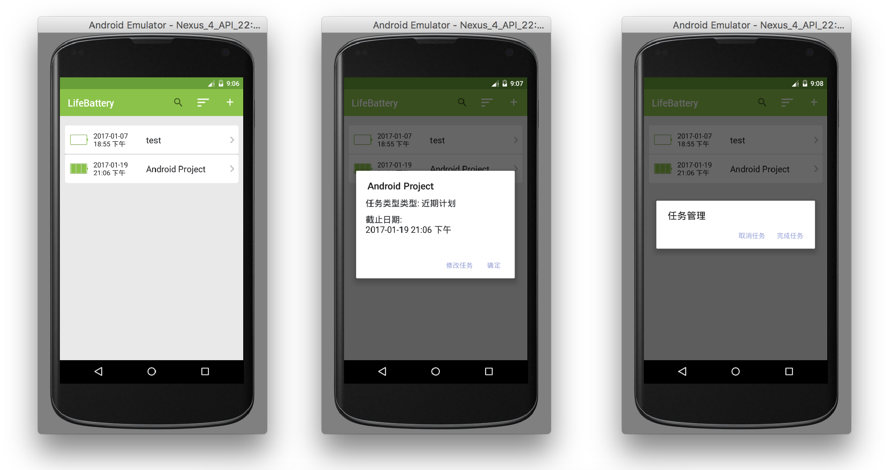
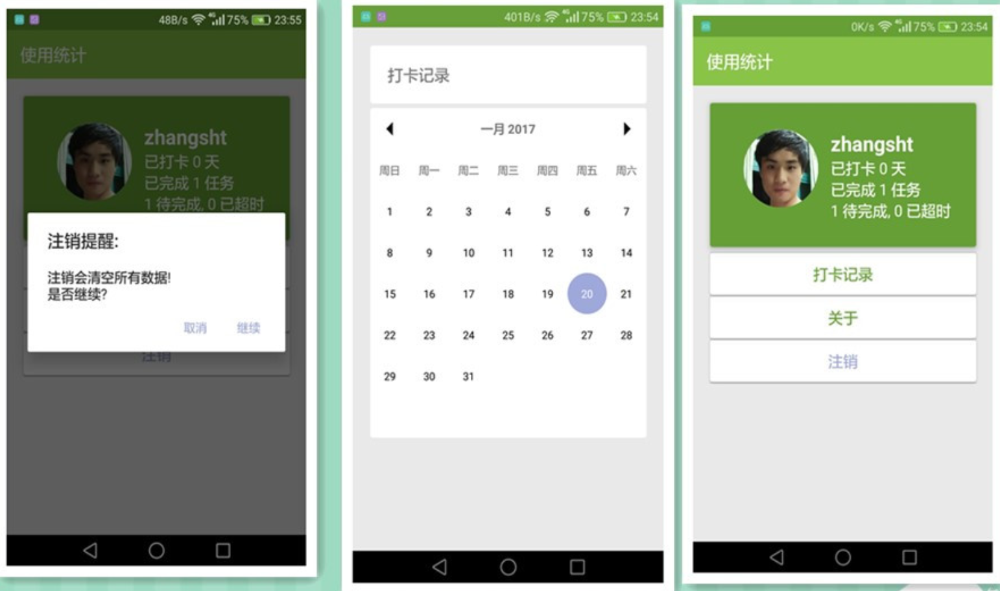
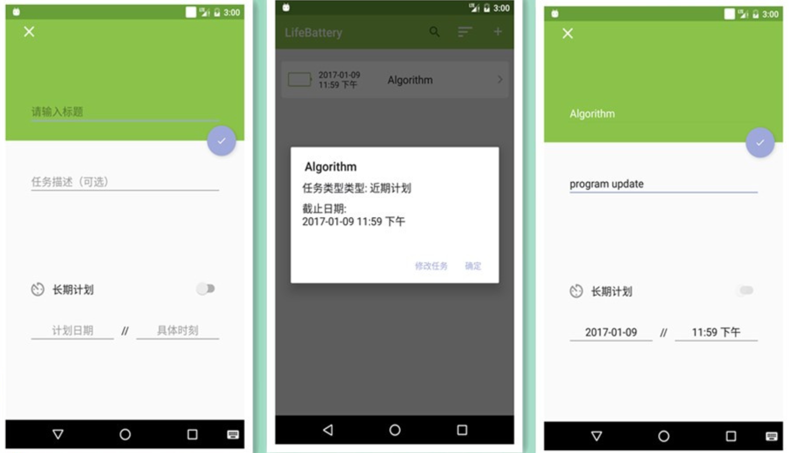
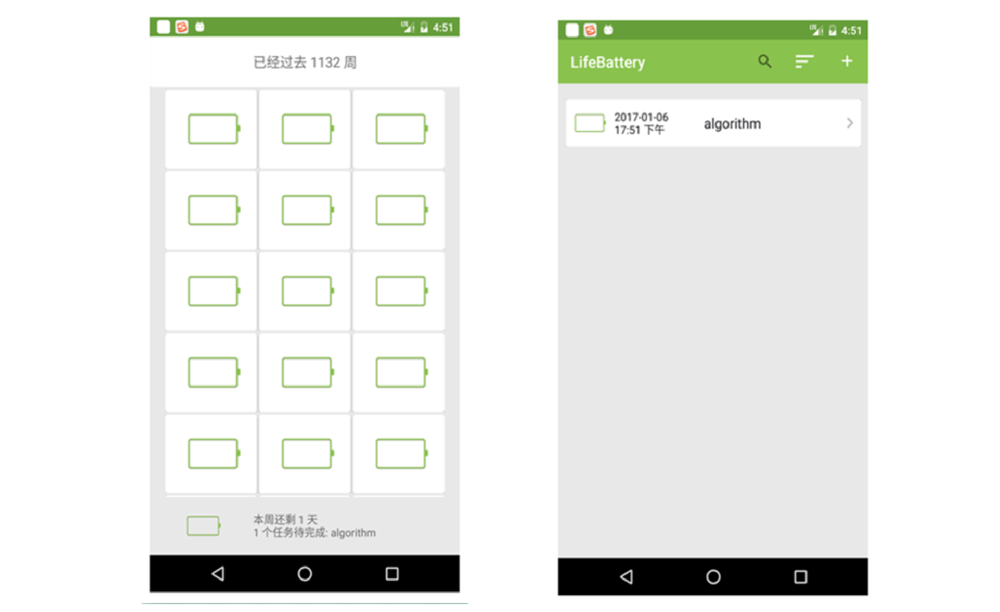

# LifeBattery

> 开发者：赵明宇、张双涛、任美子、王思佳

[TOC]

## 一、应用功能

### 1. “生命倒计时”

- 主界面: 将用户“生命中剩余的周数”以电池的形式呈现在主界面中。(数据: 用户首次次打开应用输入的生日和最新人类的平均寿命统计值)。
- 电池仓库: 动态显示过去的周(就像被用光的电池)。同时显示当前周的剩余量和本周待办任务。这样对比，警醒用户把握时间

### 2. 待办事项记录

- 长期任务(无需设置DDL): 在主页面电池窗口的右下角按钮点击随时查看，这些通常为一些人生中的“小目标”，不紧急、未计划、无DDL，但就是想要在未来去做，比如环球旅行
- 短期任务(有DDL): 对于短期任务，我们在“规划”页面中按用户添加顺序放置此类任务，用户也可以在规划界面中点击排序按钮将这些任务安装DDL迫切程度进行排序，此类任务一旦设置后App会周期性提醒用户剩余时间。

### 3. 待办事项搜索、排序、增加、修改、删除等功能

- 工具栏按钮
- 长(短)按listItem, 弹出对话框

### 4. 待办事项提醒功能

- service服务发送Notification(如果存在)
- 主界面显示最近时间的短期任务
- widget显示用户“关注”(点击)的短期任务(点击进入PlanActivity)
- widget动态显示本周剩余时间(点击进入StoreActivity)

### 5. 使用统计

- 统计打卡时间，完成、待完成、超时任务量

### 6. 其他

- 选择个性头像
- 用户注销、数据清除
- 查看应用关于

## 二、运行界面

- 开启／注册／主界面

  

- 主界面查看长远计划／Notification提醒／Widget[2]

  

- 规划界面的交互

  

- 统计界面／打卡记录／注销操作

  

- 添加、修改任务

  

- 添加任务(在本周)，对应StoreActivity变化

  

## 三、使用的技术

### 开源组件"Material-Calendar"

一个Material风格的日历视图，其中日历月视图是使用GridLayout实现的。主要用来实现打卡功能。
先在布局文件中放置`MaterialCalendarView`，然后在对应的activity中进行配置，以下代码日历空间不可点击：

```java
final MaterialCalendarView mcv = (MaterialCalendarView) findViewById(R.id.calendar);
        mcv.setSelectionMode(MaterialCalendarView.SELECTION_MODE_NONE);
```

然后通过调用`setDateSelected`方法即可为日历上对应的日期打上标记，例子：

```java
CalendarDay cd = CalendarDay.from(Integer.parseInt(ymd[0]),
                    Integer.parseInt(ymd[1]) - 1,
                    Integer.parseInt(ymd[2]));  //  2016-12-23
            mcv.setDateSelected(cd, true);
```

### MaterialDateTimePicker

该控件可以弹出一个material design风格的日期和时间选取对话框，以日历选取为例，首先将预设参数传入，然后通过`DatePickerDialog.newInstance`实例化一个`DatePickerDialog`对象，最后通过`datePickerDialog.show(getFragmentManager(), "DateFragment");`将实例化的对话框显示出来。

### 帧动画制作

在打开应用的时候制作了一个加载应用的帧动画（空电池充满电的过程），通过用四张图片以及配置一个XML的`animation-list`实现：

```xml
<animation-list xmlns:android="http://schemas.android.com/apk/res/android"
    android:oneshot="true">
    <item android:drawable="@drawable/state4" android:duration="300" />
    <item android:drawable="@drawable/state3" android:duration="300" />
    <item android:drawable="@drawable/state2" android:duration="300" />
    <item android:drawable="@drawable/state1" android:duration="300" />
</animation-list>
```

然后在主界面中通过以下代码开启动画即可：

```java
ImageView imageView = (ImageView) findViewById(R.id.setup_anim);
        imageView.setBackgroundResource(R.drawable.loading_anim);
        AnimationDrawable anim = (AnimationDrawable) imageView.getBackground();
        anim.start();
```

### Toolbar

- 搜索(系统服务SEARCH_SERVICE)、排序(数据库ORDER BY)、添加(界面跳转)

  ```java
  // 搜索
  @Override
  public boolean onCreateOptionsMenu(Menu menu) {
      getMenuInflater().inflate(R.menu.menu_main, menu);
      SearchManager searchManager =
              (SearchManager) getSystemService(Context.SEARCH_SERVICE);
      SearchView searchView =
              (SearchView) menu.findItem(R.id.searchAction).getActionView();
      searchView.setSearchableInfo(
              searchManager.getSearchableInfo(getComponentName()));
      searchView.setOnQueryTextListener(new SearchView.OnQueryTextListener() {
          @Override
          public boolean onQueryTextSubmit(String query) {
              Intent intent = new Intent();
              intent.setClass(PlansActivity.this, HandleSearchActivity.class);
              intent.putExtra("query", query);
              startActivityForResult(intent, 1);
              return true;
          }
          @Override
          public boolean onQueryTextChange(String newText) {
              return false;
          }
      });
      return true;
  }

  // 事件监听
   private Toolbar.OnMenuItemClickListener onMenuItemClick = new Toolbar.OnMenuItemClickListener() {
          @Override
          public boolean onMenuItemClick(MenuItem menuItem) {
              if (menuItem.getItemId() == R.id.addAction) {
                  Intent intent = new Intent();
                  intent.setClass(PlansActivity.this, AddActivity.class);
                  startActivity(intent);
                  return true;
              } else if (menuItem.getItemId() == R.id.sortAction) {
                  Cursor cursors = myDB.sortWithTime();
                  if (cursors != null && sca != null)
                      sca.swapCursor(cursors);
              }
              return false;
          }
      };
  ```

### SimpleCursorAdapter重写

- 实现电池图标的动态变化

### ImageView重写

- 显示圆形图片，并存储在外部SD上

  ```java
  FileOutputStream out;
  try {
      out = getApplicationContext().openFileOutput(name, Context.MODE_PRIVATE);
      bitmap.compress(Bitmap.CompressFormat.JPEG, 90, out);
      out.close();
  } catch (Exception e) {
      e.printStackTrace();
  }
  ```

### SQLite数据库操作

-    SQLite**创建表，insert、select、update、delete、query**语句

-    通过**关系运算符**和**逻辑运算符**进行超时更新、范围查询等

     ```java
              SQLiteDatabase db = getWritableDatabase();
              ContentValues cv = new ContentValues();
              cv.put("finished", "超时");
              String whereClause = "type = ? AND DDL <= ?";
              String[] whereArgs = {"false", currentTime};
              db.update(Table_Name, cv, whereClause, whereArgs);
              db.close();
     ```

-    **LIKE**子句正则匹配，完成搜索功能

     ```java
        String query_sql = "SELECT * FROM " + Table_Name + " WHERE title LIKE '%" + keyword
     + "%' ... OR finished LIKE '%" + keyword + "%'";函数获取最近时间、**ORDER BY** 按照DDL排序
     ```

-    **MIN** 函数获取最近时间、**ORDER BY** 按照DDL排序
```java
 // MIN
String query_sql = "SELECT title, MIN(DDL) AS DDL FROM " + Table_Name + " WHERE type = 		'false' AND finished = '未完成'";

  // ORDER BY
String query_sql = "SELECT * FROM " + Table_Name + " WHERE type = 'false' AND finished = '未完成' ORDER BY DDL";
```

### Notification & Service

主界面启动时绑定Service

```java
 Intent intent = new Intent(this, PlanRecorder.class);
 bindService(intent, sc, this.BIND_AUTO_CREATE);
```

利用Timer，在 TimerTask中周期性(在给定范围内随机)发送用户提醒

```java
notification = new Timer();
notificationTask = new TimerTask() {
    @Override
    public void run() {
        try {
            sendNotification();
        } catch (ParseException e) {
            e.printStackTrace();
        }
    }
};
notification.schedule(notificationTask, 0, Math.round(Math.random() * 6 + 6) * 60 * 60 * 1000);

// 绑定成功后初始化service
 public void onServiceConnected(ComponentName name, IBinder service) {
        planRecorder = ((PlanRecorder.MyBinder)service).getService();
  }
```

### Widget

- widget响应用户点击的listItem, 继承自BroadcastReceiver, 获取相应的数据

  ```java
  RemoteViews rv = new RemoteViews(context.getPackageName(), R.layout.app_widget);
  if (intent.getAction().equals("widgetReceiver")) {
      Bundle bundle = intent.getExtras();
      if (bundle != null) {
         ...
          AppWidgetManager.getInstance(context).updateAppWidget(new ComponentName(context, AppWidget.class), rv);
      }
  }
  ```

- 在**AppWidget**的onUpdate函数里， 构建两个**PendingIntent**, 跳转到PlanActivity和StoreActivity

  ```java
  RemoteViews rv = new RemoteViews(context.getPackageName(), R.layout.app_widget); rv.setOnClickPendingIntent(R.id.appwidget_Title, pi);
  rv.setOnClickPendingIntent(R.id.appwidget_battery, pi2);
   appWidgetManager.updateAppWidget(appWidgetIds, rv);
  ```

### 用户头像选取

- 从相册中选取图片，并进行圆形裁剪(亲测有人脸识别效果)

- 将读取的`bitmap`压缩成jpg格式保存

```java
  // crop 代码
  if (requestCode == PHOTO_REQUEST_GALLERY) {
      // 从相册返回的数据
      if (data != null) {
          // 得到图片的全路径
          Uri uri = data.getData();
          crop(uri);
      }
  } else if (requestCode == PHOTO_REQUEST_CUT) {
      // 从剪切图片返回的数据
      if (data != null) {
          Bitmap bitmap = data.getParcelableExtra("data");
          this.headImage.setImageBitmap(bitmap);
          SharedPreferences sp = getSharedPreferences("LifeBatteryPre", MODE_PRIVATE);
          SharedPreferences.Editor editor = sp.edit();
          editor.putBoolean("hasChoose", true);
          editor.apply();
          String name = "test.jpg";
          FileOutputStream out;
          try {
              out = getApplicationContext().openFileOutput(name, Context.MODE_PRIVATE);
              bitmap.compress(Bitmap.CompressFormat.JPEG, 90, out);
              out.close();
          } catch (Exception e) {
              e.printStackTrace();
          }
      }
  }
  ```

## 四、参考资料

- android开发者网站：https://developer.android.google.cn/index.html
- CSDN博客：http://www.csdn.net/
- Material Design：https://material.io/guidelines/material-design/introduction.html
- Material-Calendar：https://prolificinteractive.github.io/material-calendarview/
- Material-Calendar(github)：https://github.com/prolificinteractive/material-calendarview

## 五、遇到问题与解决方案

- Service运行两个线程闪退: 原来的设计思路是Service后台剩余时间提醒和超时更新，分别实现时没有问题，综合在一起出现运行闪退。解决思路：更改代码逻辑，Service里面只负责`Notification`的timeTask
- `toolbar`的搜索放在事件监听函数中不起作用。解决方案：onCreateOptionsMenu中利用`SearchManager`获取系统搜索服务，完成`SearchView.OnQueryTextListener`
- 存取用户头像闪退，提示没有相应的权限(即使在manifest中已经申请)。解决方案，在`StackOverflow`上查找问题原因，参考别人的办法
- UI界面更新不一致问题。解决方案：比如在`MainActivity`重写`onResume`函数、在`PlansActivity`利用`SharedPreferences`根据上一次超时数来判断当前提醒信息、用户退出时及时清除数据等等
